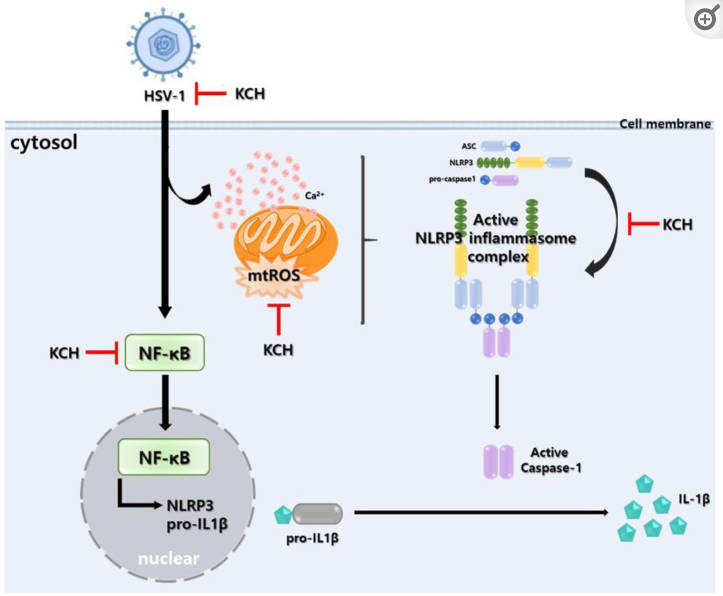

**Descubriendo el Poder Antiviral de la Miel de Castaño Coreano contra el HSV-1**

## Introducción
La lucha contra las infecciones virales, especialmente aquellas causadas por el virus del herpes
simplex 1 (HSV-1), ha llevado a la búsqueda constante de nuevos agentes antivirales. En este contexto,
un reciente estudio publicado en Antioxidants revela hallazgos prometedores sobre la capacidad de
la miel de castaño coreano (MCC) para suprimir la infección por HSV-1 mediante la regulación de la
vía del inflamasoma NLRP3 mediado por ROS.

## La Amenaza del HSV-1
El HSV-1, un virus de ADN de doble cadena, perteneciente a la familia Orthoherpesviridae, es conocido
por causar enfermedades neurológicas graves, como la encefalitis. Aunque existen fármacos aprobados
por la FDA, como el aciclovir y el valaciclovir, su uso a largo plazo conlleva efectos secundarios
y la aparición de cepas resistentes a los medicamentos. En este contexto, la búsqueda
de nuevos agentes antivirales seguros y efectivos es crucial.

## Miel de Castaño Coreano
El estudio destaca la miel de castaño coreano como un agente potencialmente revolucionario. Conocida
por sus diversas propiedades farmacológicas, como antioxidantes, antibacterianos y antiinflamatorios,
esta miel ha revelado un nuevo aspecto de su capacidad: la inhibición de la infección por HSV-1.

## Mecanismo de Acción
El estudio revela que la miel de castaño coreano actúa en múltiples frentes. En primer lugar, inhibe
la infección de las células huésped. Además, reduce la producción de especies reactivas de oxígeno
(ROS) y calcio (Ca2+) después de la infección por HSV-1, suprimiendo la actividad del factor nuclear
kappa de células B activadas (NF-кB) y la producción de citoquinas inflamatorias.

## Inhibición del Inflamasoma NLRP3
Un descubrimiento destacado es la capacidad de la miel de castaño coreano para inhibir la expresión
del inflamasoma nod-like receptor protein 3 (NLRP3) durante la infección por HSV-1. Este hallazgo
sugiere un efecto clave en la ruta del inflamasoma NLRP3 mediado por ROS.

## Conclusiones
Los resultados del estudio sugieren que la miel de castaño coreano no solo inhibe la replicación viral
sino que también afecta la vía del inflamasoma NLRP3 mediado por ROS, ofreciendo así un enfoque
multifacético en la lucha contra el HSV-1. Estos hallazgos abren la puerta a nuevas posibilidades
para el tratamiento de la infección por HSV-1 y enfermedades relacionadas. 

> En resumen, la miel de castaño coreano podría ser la respuesta anhelada para combatir eficazmente esta amenaza viral,
proporcionando una alternativa segura y efectiva a los tratamientos convencionales.

## Referencias
Kwon EB, Kim YS, Kim B, et al. Korean Chestnut Honey Suppresses HSV-1 Infection by Regulating the
ROS-NLRP3 Inflammasome Pathway. Antioxidants (Basel). 2023;12(11):1935. Published 2023 Oct 30. 
<a href="https://www.ncbi.nlm.nih.gov/pmc/articles/PMC10669648/" target="_blank">Ir</a>