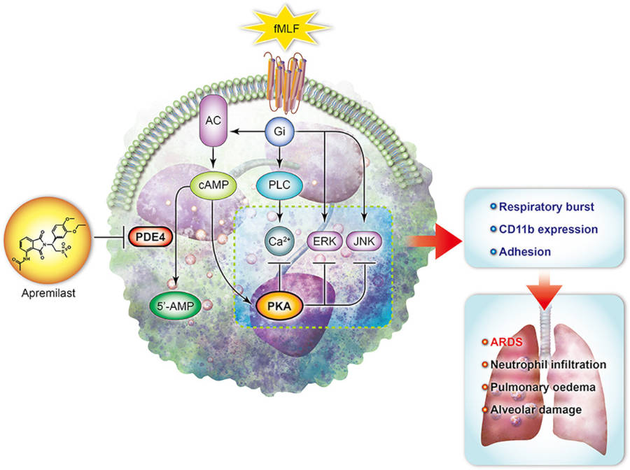

**Apremilast: Una Prometedora Alternativa en el Tratamiento del Síndrome de Dificultad
 Respiratoria Aguda (SDRA).**

## Introducción
El síndrome de dificultad respiratoria aguda (SDRA) es una condición crítica caracterizada
por la disfunción pulmonar aguda y la inflamación severa. Un estudio reciente, publicado
en Biomedical Journal en 2023, revela hallazgos prometedores sobre el papel del apremilast
en el tratamiento del SDRA al inhibir el proceso inflamatorio inducido por neutrófilos.
El equipo de investigación liderado por Yung-Fong Tsai exploró los efectos del apremilast
en neutrófilos humanos activados y evaluó su eficacia. Los resultados mostraron que el apremilast
disminuyó significativamente la producción de anión superóxido, la generación de especies
reactivas de oxígeno, la expresión de CD11b
y la adhesión de neutrófilos en modelos de activación.

## Mecanismo de acción 
Mecanismo de Acción:
Se observó que el apremilast eleva los niveles de monofosfato de adenosina cíclico (cAMP) y
la actividad de la proteína quinasa A (PKA) en neutrófilos activados. Además, redujo la
actividad de la fosfodiesterasa específica de cAMP celular (PDE) y selectivamente inhibió
la actividad enzimática de PDE4. La vía cAMP/PKA inhibió la fosforilación de las proteínas
quinasas ERK y JNK, así como la movilización de Ca2+ en neutrófilos activados.

## Resultados 
Los estudios in vivo utilizando un modelo murino de SDRA inducido por lipopolisacáridos (LPS)
revelaron que el apremilast atenuó la infiltración de neutrófilos en los pulmones, la actividad
de mieloperoxidasa (MPO), el edema pulmonar y el daño alveolar.

## Conclusiones
En conclusión, el apremilast demostró inhibir respuestas inflamatorias después de la
activación de neutrófilos mediante la inhibición cAMP/PKA-dependiente de la activación
de ERK y JNK. Este estudio sugiere que el apremilast suprime el estrés oxidativo y la
quimiotaxis al inhibir selectivamente la PDE4 en neutrófilos, lo que proporciona
una protección efectiva contra el SDRA inducido por endotoxinas en ratones. Estos
hallazgos plantean la posibilidad de utilizar el apremilast como un medicamento alternativo
en el tratamiento de daños pulmonares agudos, ofreciendo una nueva perspectiva en el
abordaje del SDRA.

## Referencias
Tsai YF, Chen CY, Yang SC, Syu YT, Hwang TL. Apremilast ameliorates acute respiratory
distress syndrome by inhibiting neutrophil-induced oxidative stress. Biomed J. 2023;46(4):100560.
<a href="https://www.sciencedirect.com/science/article/pii/S2319417022001354?via%3Dihub" target="_blank">Ir.</a>

